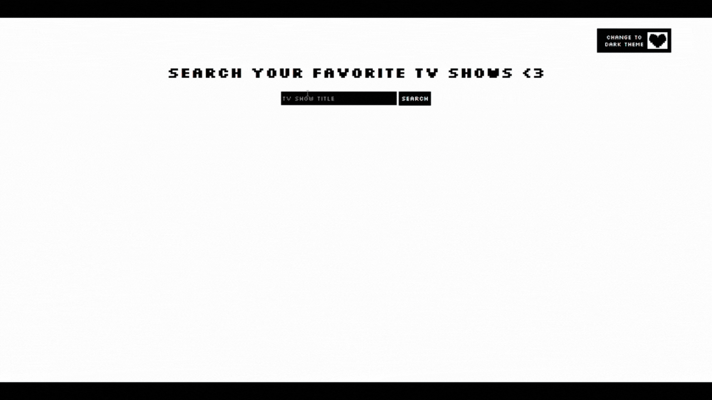

# TV Searcher and Ranker

## Overview
This web app will allow users to Search for and rank their favorite TV shows!

## Tech Stack
- HTML
- CSS
- JavaScript
- Express
- Node.js

## Features
- Search for TV shows dynamically using the TVMaze API
- Displays the images pertaining to the show, which can then be ranked into 5 categories
- Any show that has been added by mistake, can be deleted by double clicking on the image
- Light and Dark Mode Available
- Future backend will allow saving favorite shows and the ranking list

## Live Demo


## How to Run

Follow these steps to run the project locally:

### 1. Navigate to the project directory
```bash
cd your-project-folder
```

### 2. Install dependencies
```bash
npm install
```

### 3. Start the server
```bash
node index.js
```

### 3. Visit the following URL in your browser
http://localhost:3000/home


## API Used

This project uses the [TVMaze API](https://www.tvmaze.com/api) to fetch TV show data dynamically.

## Future Improvements
- Add database
- Deploy to cloud

## Author
Preethi Maran
